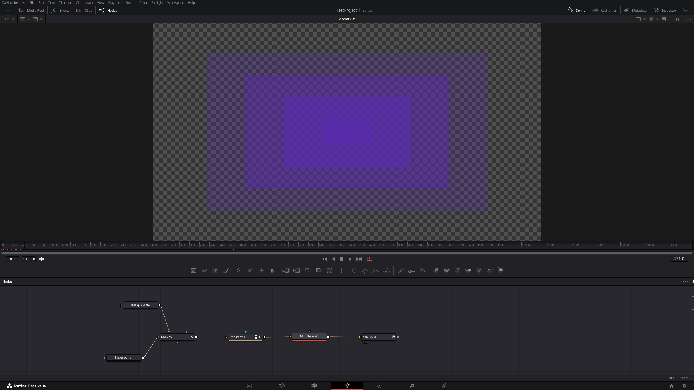
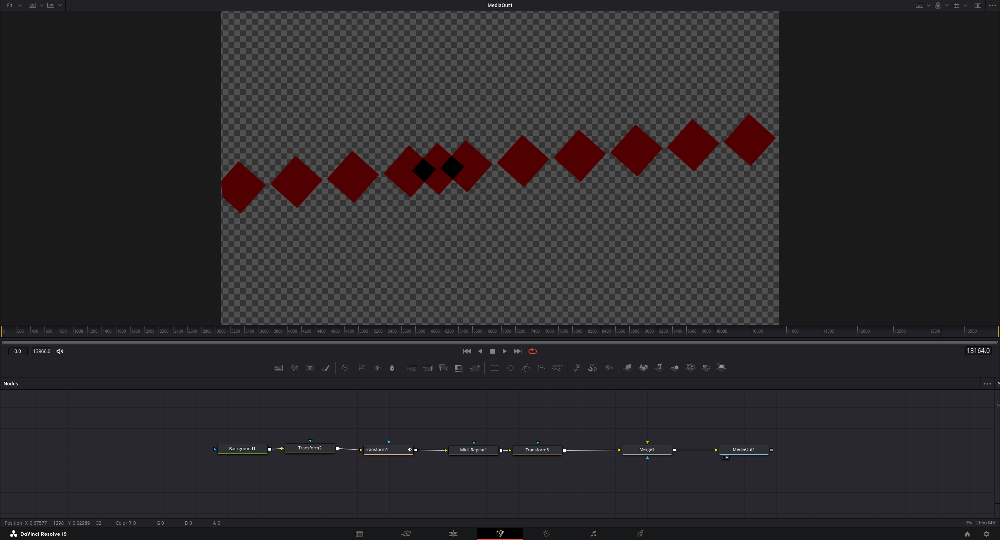

# DaVinci-Resolve-FH-BeatBar-Script
Used for iterating animations to WAV file(s) by automatically duplicating the animation on every audio pulse. 

## Installation 

All you need to do is relocate the files into the appropriate folders. 

#### midiEdited.lua needs to be in your modules folder.
##### DaVinci Resolve
macOS:    ~/Library/Application Support/Blackmagic Design/DaVinci Resolve/Support/Fusion/Modules/Lua  
Windows:  C:\ProgramData\Blackmagic Design\DaVinci Resolve\Fusion\Modules\Lua  
Linux:    ~/.local/share/DaVinciResolve/Fusion/Modules/Lua/  
##### Fusion (Standalone)
macOS:    ~/Library/Application Support/Blackmagic Design/Fusion/Modules/Lua  
Windows:  C:\ProgramData\Blackmagic Design\Fusion\Modules\Lua  
Linux:    ~/.fusion/BlackmagicDesign/Fusion/Modules/Lua  

#### RecursiveMidiRepeat.fuse needs to be in your fuses folder.
##### DaVinci Resolve
macOS:    ~/Library/Application Support/Blackmagic Design/DaVinci Resolve/Support/Fusion/Fuses  
Windows:  C:\ProgramData\Blackmagic Design\DaVinci Resolve\Fusion\Fuses  
Linux:    ~/.local/share/DaVinciResolve/Fusion/Fuses  
##### Fusion (Standalone)
macOS:    ~/Library/Application Support/Blackmagic Design/Fusion/Fuses  
Windows:  C:\ProgramData\Blackmagic Design\Fusion\Fuses  
Linux:    ~/.fusion/BlackmagicDesign/Fusion/Fuses  

After the files are in the appropriate place, restart DaVinci Resolve.  
You'll be able to find it in the fusion menu under the Fuses tab. Look for "Wav_Repeat" (right click > Add Tool > Fuses > Wav_Repeat)

## Usage

### Audio prep

I recommend that you prepare your audio in a DAW, any should work. First, you get a really short click sound (here is an example: ) then you copy it everywhere you want a beat to show up. I recomend you use a sampler so you can replace the sound with other drum noises later. Then you just export the clicks as an 8 or 16 bit wav file.  

### Animation setup

Connect the output of the node that makes up your animation into the midi_repeat node, once you have done that, you will now need to specify some values. These values are the beginning and end frames of your animation, an offset which controls where in the animation you want the midi note to play at, and the path to the midi file.

### Timeline settings

These settings can be autofilled for the most part, but since I've had consistent issues with fusion's framerate being different from the timeline one, this was disabled for "Project Frame Rate". If you find your animation to be playing too slow, try halving or doubling this. 

### Add and remove times

You have the ability to add and remove recorded times from the list without having to go and change your actual wav file. This enables you to make small changes fast. 

To do this, you need to put a lua table in the provided text box(s). For example {0,1,2} in the Add Midi text box will add a time at frame 0, 1, and 3.  
You can autofill the text boxes with a button that grabs the timing from markers in your project. There are filters in case you dont want every market to end up in the text box. 

I've provided a list of the recorded times in the consol (go to "Workspace > Console" at the top) to help with removing times.

### Advanced

Deduplication (frames)  
Wav files will probably record a lot of junk for every note, this lets you clean that up. If you find extra notes to be playing, increase this. This is in frame scale, so it will delete a note if it will be in the same place as the current note next frame (if set to 1). 

Disable Rounding  
You may end up having situations where a beat will play halfway between 2 frames. This can be problematic in timelines with low fps (below 144 fps), and to resolve this, you can have fusion calculate what a frame would be during that half frame. However, this will tank performance, so I reccomend turning it on only before rendering.

Manually Cache Frames  
This caches the frames of your animation, that way you wont need to recalculate any frames. This is incompatable with other settings. 

Flip Tail  
If you have overlapping content in your frames, it will let you control how they overlap before the offset (Frame of Beat) independantly.

Use Loops  
If you want to make a value change outside of the specified animation, you can set the animation to loop in the spline editor and then check this to open up those controls for use.  

Alternatively you can achieve a similar effect by setting up 2 animations and fading between them with a dissolve node.
